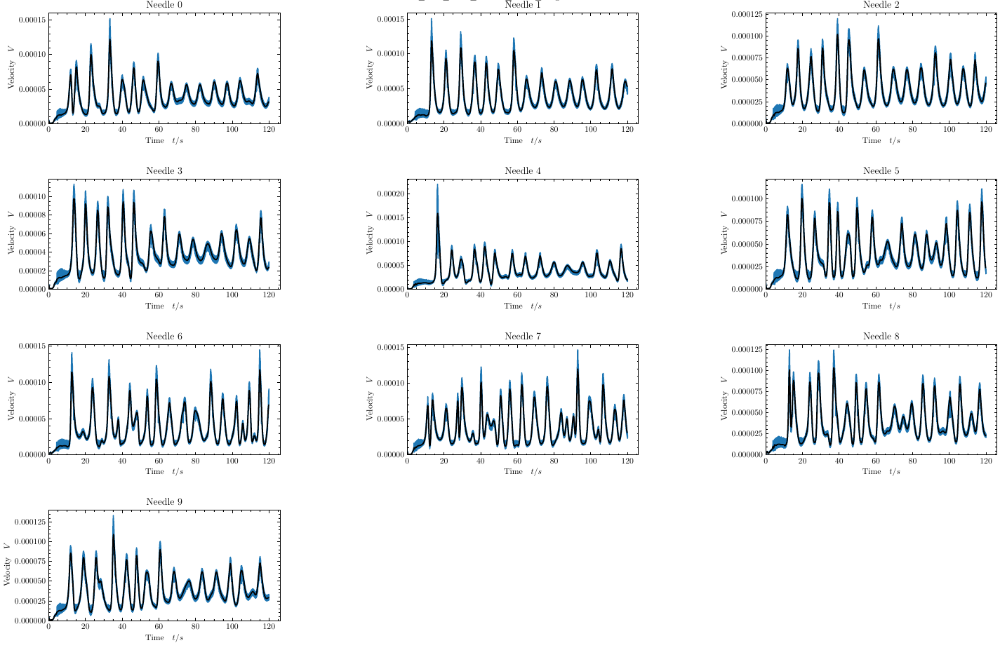
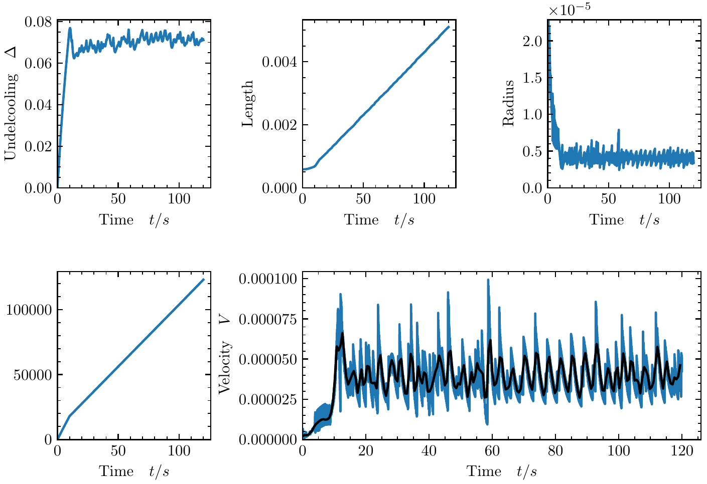
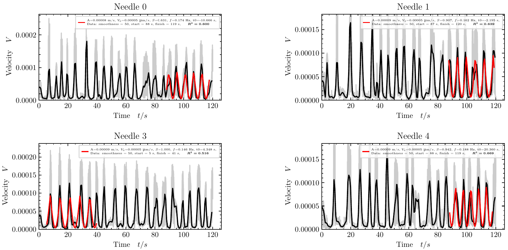

# DNN-FittyPlot
Code developed during the completion of the bachelor's thesis titled *"Computational Study of Oscillatory Growth Instability in Directional Solidification of Alloys"* as part of a Research Initiation Fellowship (RIF) at the IMDEA Materials research center.

The work undertaken within this thesis has also led to the publication of a peer-reviewed article focusing on the mechanisms of the buoyancy-induced oscillatory growth instability in directional solidification. If you find this work (or code) helpful please consider citing.
```
@article{barbera2023,
	doi = {10.1088/1757-899X/1281/1/012050},
	url = {https://dx.doi.org/10.1088/1757-899X/1281/1/012050},
	year = {2023},
	month = {may},
	publisher = {IOP Publishing},
	volume = {1281},
	number = {1},
	pages = {012050},
	author = {Josep María Barberá and Thomas Isensee and Damien Tourret},
	title = {On the occurrence of buoyancy-induced oscillatory growth instability in directional solidification of alloys},
	journal = {IOP Conference Series: Materials Science and Engineering},
}
```
> This study was supported by the Spanish Ministry of Science and Innovation through the María de Maeztu seal of excellence of IMDEA Materials Institute (CEX2018-000800-M).

## Content
- [**Source code**](#source-code)
    1. [Automated Launch](#1-auto-launch)
    2. [Plotting](#2-plotting)
    3. [Fitting](#3-fitting)
- [**Acknowledgments**](#acknowledgments)

## Source code
### 1. Auto-Launch

**create_input_files.ipynb** is the main file for this repository.

To get started with creating input files for simulations, follow these steps:

1. Define the name of the new simulation (refer to the 'Project folder structure' section).

2. Execute the notebook. It will create a folder for your new simulation along with other necessary directories.

3. You must define the following parameters:
    - Basic simulation parameters
    - The path to cluster executables that you will be using
    - The simulation matrix, structured as follows:

```python
simulations = ([
    [1, 'thor', 4, [14, 18, 21, 30], [4, 5, 6, 7], 1.24, 630, 638, 120, 0],
    [5, 'thor', 5, [10, 15, 21, 30], [5, 6, 7, 4], 1.1, 630, 638, 120, 0],
    [2, 'thor', 6, [9, 15, 21, 30], [6, 7, 4, 5], 1.0, 630, 510, 100, 0],
    [6, 'thor', 7, [9, 14, 18, 21], [7, 4, 5, 6], 0.94, 630, 510, 100, 0],
    [3, 'thor', 8, [7, 14, 18, 21], [4, 5, 6, 7], 0.9, 630, 398, 90, 0],
    [7, 'thor', 9, [7, 10, 14, 18], [5, 6, 7, 4], 0.8, 630, 398, 90, 0],
    [4, 'thor', 10, [7, 10, 14, 18], [6, 7, 4, 5], 0.7, 630, 398, 90, 0],
    [8, 'thor', 9, [14, 18], [4, 5], 0.8, 1470, 398, 90, 0],
    [9, 'thor', 10, [10, 14], [6, 7], 0.7, 1470, 398, 90, 0]
])
```
Once executed, you will generate three types of files: input files (.in), launchers (.sh), and scp files (also .sh).

Outside of the simulation folder created, you will find an scp file. Running this file will upload all the generated files (located inside the simulation folder) to the server. Ensure you have a stable and fast connection with the server as it relies on scp for file transfer.

### 2. Plotting

**plotting.py** is the executable file designed for plotting a dynamic grid of figures, where the number of figures within the plot can vary.

Here's how it works:
1. **Data File Search:** The script navigates within a folder to search for specific data files with a `.dat` extension, each corresponding to a different simulation.

2. **Plotting:** It then proceeds to plot various data, such as velocity vs. time, and can also generate a smooth version of the velocity by calculating the derivative of the position, allowing you to choose the level of smoothness.



3. **Folder Creation:** Additionally, the script creates a folder named 'small_grid' within which it generates another set of plots, each containing other relevant information for each simulation. An example of such plots can be found in the 'examples' folder.



4. **Customization:** In the `main()` section of the code, you have the flexibility to define your own customization options for plotting. It's advisable to define any preferred aliases in your `.bashrc` or `.zshrc` file to streamline the execution of this script.


### 3. Fitting

This notebook, **signal_fitting.ipynb**, holds significant importance. It serves as a tool for function fitting, offering an innovative approach.

Key Features:
- **Dynamic Fitting:** This notebook implements dynamic fitting, both forward and backward. It provides initial guess values and uses boundaries for the fitting process. The notebook iterates through the data, expanding the fitting range to find the best R^2 values for the fit while ensuring an adequate time range for fitting.
- **Frequency Guess Values:** Notably, guess values for the frequency are derived from the Fast Fourier Transform (FFT) of the data.
- **Function Variants:** Two functions, 'spiky' and 'decaying,' are utilized. The FITTING variable should be adjusted: set it to True for 'spiky' and False for 'decaying.'
- **Directory Configuration:** The HOME variable, set to 0, allows for configuring directories for different locations, such as home and IMDEA, which can be significant for workflow organization.
- **Key Parameters**:
    - `folders = glob.glob("v10_N10_*")`: Specify the name of the desired simulation to fit here.
    - `desired_start = 9`: This parameter determines the start time for the fitting range, and it holds considerable importance.
    - `dimensionless = 0`: Initially set to 0, but if you prefer to use dimensionless values, change it to 1.



Additionally, there are other smaller details, some of which are commented on in the Jupyter or Python files, while others are not. Feel free to contact me at chemabc@gmail.com if you have any questions or require further assistance. I'm here to help!

## Acknowledgments

This work would not have been possible without the invaluable guidance of Damien Tourret and the consistent assistance of Thomas Isensee.

I also extend my gratitude to the rest of Damien's group at IMDEA: Jose, Jorge, Adrian, Mohamed, and Rouhollah, for their continuous support.

Finally, I would like to express my thanks to the Spanish Ministry of Science and Innovation for their support through the María de Maeztu seal of excellence at the IMDEA Materials Institute (CEX2018-000800-M).


